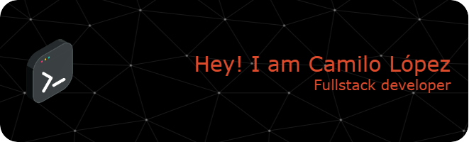

# 👋 Hi, I'm Camilo López! 

  

I am a dedicated web **developer** with expertise in _React_, _Next.js_, _Vue_, and _Astro_, specializing in crafting efficient, scalable, and results-driven web solutions. Renowned for my **commitment** and **responsibility**, I consistently deliver **high-quality projects on time, exceeding expectations.**

Passionate about **continuous learning**, I actively explore emerging technologies and embrace challenges that foster my professional growth. I thrive in innovative teams, contributing my skills to drive impactful solutions while expanding my expertise in the ever-evolving field of web development.

---

## 🚀 About Me

-   💻 I work with **React, Vue, Astro, Next.js, Node.js, Express, Firebase**
-   🌱 Currently delving deeper into the MERN stack, with a particular focus on React.
-   🧑‍💻 Focused on **Frontend Development / Fullstack Development**.

---

## 🛠️ Technologies & Tools

Here are some tools and technologies I frequently use:

### Languages

### Frontend

### Frontend Design

### Backend

### Databases

### Others

---

<!-- ## 📂 Featured Projects

### 🖥️ [Project 1 Title](#)

> Brief description of the project.

-   **Tech Stack**: [React, Firebase, etc.]
-   **Live Demo**: [Link to demo](#)
-   **Source Code**: [Link to repository](#) -->

## 📈 GitHub Stats

<!--  -->

---

## 📫 Let's Connect

-   💼 [Portfolio](https://camilolopez15.github.io/)
-   👔 [LinkedIn](https://www.linkedin.com/in/camilo-lp/)
-   📧 [Email](mailto:camilolopez1506@gmail.com)

---

_Thanks for stopping by! Feel free to explore my projects and connect with me._ 😊
